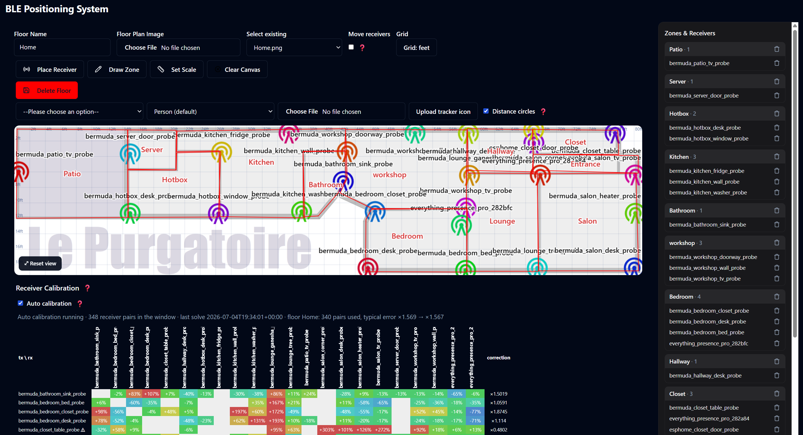
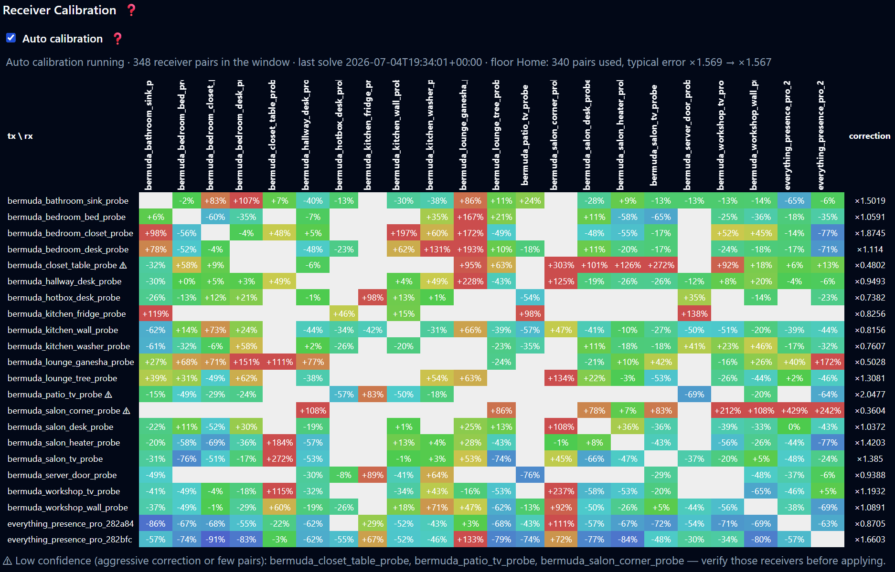

# BLE Positioning System (BPS) — enhanced fork

This is a fork of [**Hogster/BPS**](https://github.com/Hogster/BPS) that adds a
large set of features and fixes on top of the original.

**New here?** Read the upstream project first — this fork does not repeat it:

- [**Upstream README**](https://github.com/Hogster/BPS/blob/main/README.md) — what
  BPS is, how it trilaterates BLE distances into a position, and the Bermuda
  dependency.
- [**Upstream Wiki**](https://github.com/Hogster/BPS/wiki/) — the full setup
  walkthrough (placing receivers, defining zones, the Lovelace map card).

Everything in the upstream docs still applies. This README documents **only what
this fork changes or adds**.

Full credit for the original integration goes to [@Hogster](https://github.com/Hogster),
and to [@agittins](https://github.com/agittins) for [Bermuda](https://github.com/agittins/bermuda),
which BPS builds on.

---

## What this fork adds

Positioning & sensors
- [Nearest-zone sensor](#nearest-zone-sensor) — a room even when the fix is between zones.
- [Positions stay on the map](#positions-stay-on-the-map) — no more fixes flung into walls or off the plan.
- [Away detection](#away-detection) — trackers disappear when nobody's home, instead of lingering forever.
- [Reliable across reboots](#reliable-across-reboots) — sensors come back on their own after a restart.

The setup panel
- [Modern, dark, zoomable panel](#modern-dark-zoomable-panel) — dark theme, zoom/pan, a distance grid, a zone-grouped sidebar.
- [Polygon zones](#polygon-zones) — any shape, not just rectangles.
- [Pre-populated receiver picker](#pre-populated-receiver-picker) — pick receivers from a list instead of typing names.

Accuracy
- [Receiver auto-calibration](#receiver-auto-calibration) — the probes calibrate each other, continuously.
- [Trilateration visualization](#trilateration-visualization) — see the distance circles that place each device.

The Lovelace card
- [Receivers on the map card](#receivers-on-the-map-card) — show your proxies, colored by online/offline status.

---

## Installation

Install this fork through HACS as a custom repository:

1. HACS → **Integrations** → ⋮ → **Custom repositories**.
2. Repository: `maxi1134/BPS`, Category: `Integration`. Click **Add**.
3. Install **BLE Positioning System**, restart Home Assistant, then add the
   integration under **Settings → Devices & Services → Add Integration → BPS**.

Configure which Bluetooth devices to track through Bermuda, exactly as in the
upstream docs.

### SciPy dependency

This integration depends on SciPy, which requires native binary support.

- Supported: 64-bit Home Assistant installs (aarch64 / ARM64 or x86_64).
- Not supported: 32-bit systems (e.g. ARMv7).

Even on supported hardware, installation can fail inside the restricted Python
environment some HA installs use. If you hit that, run Home Assistant in a
container where you control the Python environment.

---

## Nearest-zone sensor

Each tracked device already exposes `sensor.<device>_bps_floor` and
`sensor.<device>_bps_zone`. This fork adds a third:

- **`sensor.<device>_bps_nearest_zone`** — always the *closest* zone on the
  device's floor, even when the position lands between zones or outside the
  map. Inside a zone it matches `_bps_zone`. It reads `unknown` **only** when
  the device is out of range (no receiver currently measures a distance to it).

`_bps_zone` reports `unknown` whenever the fix falls outside every zone — which
trilateration jitter causes often. `_bps_nearest_zone` is the sensor to
automate on when you want "which room is this person effectively in", and its
`unknown` is a clean "nobody home / out of range" signal.

## Positions stay on the map

Noisy BLE readings used to let the solver place a device far outside the floor
plan, or in the dead space between rooms. This fork constrains positioning in
two ways:

- The trilateration solver is **bounded to the floor** (the extent of its
  receivers and zones), so a fix can never leave the map — when an
  unconstrained solve would escape, the result lands on the boundary instead.
- A fix that still sits outside every zone is **snapped to the nearest point of
  the nearest zone** before it's published.

The map card, `/api/bps/cords`, and the zone sensors all see the same corrected
position.

## Away detection

Previously a person who left home stayed frozen on the map at their last
position indefinitely, with the zone and floor sensors stuck at their last
values.

Now a tracker that **no receiver has detected for 5 minutes** disappears from
the map, and its `_bps_zone`, `_bps_floor` and `_bps_nearest_zone` sensors go
to `unknown`. It reappears on the first fix once it's back in range. Tune the
grace period with a top-level `"position_timeout"` (seconds) in `bpsdata.txt`.

(For a faster "out of range" signal, `_bps_nearest_zone` already reacts within
~30 s — Bermuda's own distance timeout — while the map position keeps the
5-minute grace so brief detection gaps don't blink people off the map.)

## Reliable across reboots

BPS used to stop producing data after a full restart until you manually
reloaded the integration. The sensors are now recreated correctly on boot even
when their registry entries survived an unclean shutdown, and BPS cancels its
background tasks promptly at shutdown so restarts stay clean.

---

## Modern, dark, zoomable panel



The BPS side panel was reworked into a modern, dark-themed layout, and the map
itself is now interactive:

- **Zoom** with the mouse wheel (cursor-centered, 1×–8×) and **pan** by
  dragging. A **Reset view** button sits in the lower-left corner. Zooming and
  panning never change your placed coordinates — it's purely a view.
- **Distance grid** overlay (toggle in the toolbar), spaced from the floor's
  calibration scale, in **meters or feet**. Grid labels stay pinned to the
  visible edges and readable at any zoom.
- **Zones & Receivers sidebar** replaces the old floating list: one section per
  zone, with the receivers that physically sit inside each zone listed under it,
  plus a delete button on every row.
- If you have a **single floor**, the panel opens straight onto it.
- **Zone names** are centered in their room and **receiver labels** are centered
  and clamped so they can't overflow the plan.

### Moving and focusing receivers

- A **Move receivers** toggle (off by default) controls dragging. With it on,
  drag a receiver to reposition it, then **Save Floor Plan**. With it off,
  dragging pans the map.
- With Move off, **clicking a receiver focuses it** — only that receiver, its
  distance circle, and the tracked device stay on the map, so you can study one
  receiver's contribution. Click it again, or click empty space, to show
  everything.


## Polygon zones

Zones are no longer limited to rectangles. When drawing a zone:

- **Click the floor plan to place each corner**, one by one — any shape with
  three or more corners, including L-shaped rooms.
- **Drag a corner** to adjust it, or **drag inside the zone** to move the whole
  shape. Dragging is clamped so a corner can never end up off-screen (the old
  trap where an off-canvas handle became ungrabbable).
- **Right-click** removes the last corner.

Zones drawn with the old rectangle tool keep working unchanged.

## Pre-populated receiver picker

Placing a receiver no longer means typing its Bermuda scanner name from memory.
You now pick it from a **dropdown of every receiver Bermuda currently reports**
(derived from the `sensor.*_distance_to_*` entities), with a "Custom name…"
option for receivers Bermuda hasn't seen yet.

Receivers already placed on **any** floor are hidden from the list — a receiver
belongs to exactly one floor, and placing the same one on several floors would
make those floors compete for the tracker.


---

## Receiver auto-calibration

BLE distance estimates vary per receiver (antenna, enclosure, mounting, TX
power). This fork can measure and correct that automatically — the same idea as
ESPresense-companion's node calibration, but with zero manual configuration.

The receivers calibrate **each other**: every probe advertises an iBeacon, so
its siblings range it, and comparing those probe-to-probe distances against the
receivers' placed positions reveals each receiver's error.

### Prerequisite: make each probe advertise

Add one block to your ESPHome proxies. The whole fleet shares the UUID; make the
`minor` unique per probe (deriving it from the static IP's last octet needs no
per-device edits):

```yaml
esp32_ble_beacon:
  type: iBeacon
  uuid: fde3b150-2f64-43ba-aee9-867f75ee4a6f
  major: 1
  minor: ${ static_ip.split('.')[3] | int }
  min_interval: 500ms
  max_interval: 1000ms
```

Nothing needs to be set up in Bermuda — BPS reads the probe-to-probe
measurements through the `bermuda.dump_devices` service.

### Running it

In the panel's **Receiver Calibration** section, select a floor and start a run
(10 minutes is a good default). The result is a matrix: rows transmit, columns
receive; **blue cells measure short, red cells measure long**. Through-wall
pairs showing red is expected — walls only lengthen BLE estimates, and the fit
accounts for that by trusting each receiver's cleanest paths and the wall-free
difference between the two directions of every pair. Receivers flagged ⚠ got an
aggressive correction or had too few usable pairs (typically no line of sight to
any sibling) — verify their placement before applying.



**Apply corrections** stores a per-receiver factor in `bpsdata.txt`, and the
backend multiplies every distance that receiver reports from then on. Because
Bermuda's path-loss model is exponential, this is exactly equivalent to a
per-scanner RSSI offset — and the result lists the equivalent Bermuda
"Calibration 2" `rssi_offset` per scanner if you'd rather calibrate at the
source. Corrections are **relative** (normalized so they never rescale all
distances at once); the absolute scale stays with Bermuda's own
`ref_power`/`attenuation`. **Reset corrections** removes them.

### Auto calibration

Toggle **Auto calibration** and it runs permanently: sampling every 30 seconds
into a rolling ~6-hour window, re-solving every 15 minutes for every floor, and
re-applying corrections whenever they shift by more than 1%. It keeps adapting
as the environment changes (furniture moves, a probe is swapped, a door stays
open). The toggle and the latest solve/window are persisted
(`bps_calibration_state.json`), so after a restart the matrix reappears
immediately and the window resumes warm instead of rebuilding from zero.

## Trilateration visualization

During tracking, a **Distance circles** toggle draws each receiver's measured
distance as a circle around it — the tracked device sits where the circles
intersect, which makes the trilateration (and any mis-calibrated receiver)
visible at a glance.

- Each receiver's **icon takes the color of its circle**, so you can tell which
  circle belongs to which receiver even when they overlap.
- Each receiver carries a **pill showing the measured distance** (in the grid's
  unit — meters or feet).
- The circles and distances are the **exact radii the solver used**, including
  any calibration corrections — not a separate estimate.


---

## Receivers on the map card

The Lovelace map card can now draw your receivers (bluetooth proxies), colored
by whether they're working:

```yaml
type: custom:bps-map-card
floor: first
entities:
  - sensor.eriks_iphone_16
show_receivers: true
show_receiver_labels: true   # optional: print the receiver name next to the icon
scale_receiver_icon: 100     # optional: receiver icon size (defaults to scale_icon)
scale_receiver_labels: 75    # optional: receiver label size (defaults to scale_labels)
receiver_status:             # optional: explicit status entity per receiver
  nsp_kitchen: binary_sensor.nsp_kitchen_status
```

The beacon icon is drawn **black when the receiver is working** and **red when
it is offline/unavailable**. The decision is made per receiver, first match
wins:

1. **`receiver_status` mapping** (if given): the mapped entity decides — `off`,
   `unavailable`, `unknown`, `not_home`, `offline` show red, anything else
   black. Any entity of the device works (e.g. an uptime sensor). Map a receiver
   to `false` (or `heuristic`) to skip tiers 2–4 and force the distance
   heuristic.
2. **Bermuda scanner liveness** (automatic): the card asks Bermuda
   (`bermuda.dump_devices`) and matches scanners to receivers by name. A
   receiver is working while its scanner heard *any* advertisement within
   `receiver_timeout` seconds (default 30, min 10). This is the strongest tier —
   it catches a proxy whose BLE scanning died while its network stayed up.
3. **`binary_sensor.<receiver>_status`** with device class `connectivity` — the
   conventional ESPHome `status` sensor.
4. **Device availability** (automatic): the HA device whose name matches the
   receiver is online while any of its entities isn't `unavailable`. A
   connectivity-class entity of that device is authoritative.
5. **Bermuda distance sensors** (fallback): working while at least one
   `sensor.*_distance_to_<receiver>` reports a distance (Bermuda holds the last
   reading ~30 s), so a dead — or unreachable — proxy turns red after about half
   a minute.

Tiers 2–4 need no configuration and match by the receiver name you used in the
panel (normally the proxy's HA device name). If a receiver shows red while the
device is online, map it explicitly in `receiver_status`.

The full card guide (all options, per-floor behavior, labels/icons/zones,
troubleshooting) is in the [upstream wiki](https://github.com/Hogster/BPS/wiki/Lovelace-map-card).

---

## Feedback & contributions

Issues and pull requests for these additions are welcome on
[maxi1134/BPS](https://github.com/maxi1134/BPS). For the core integration and
general BPS discussion, see [Hogster/BPS](https://github.com/Hogster/BPS) and
the [Home Assistant Community thread](https://community.home-assistant.io/t/bps-the-indoor-precise-tracking-system/843429).

This is teamwork on top of two great projects — [Bermuda](https://github.com/agittins/bermuda)
by [@agittins](https://github.com/agittins) and [BPS](https://github.com/Hogster/BPS)
by [@Hogster](https://github.com/Hogster). Improving Bermuda's precision and
stability benefits BPS directly.
