# BLE Positioning System (BPS) — enhanced fork

This is a fork of [**Hogster/BPS**](https://github.com/Hogster/BPS) that adds a
large set of features and fixes on top of the original.

**New here?** Read the upstream project first — this fork does not repeat it:

- [**Upstream README**](https://github.com/Hogster/BPS/blob/main/README.md) — what
  BPS is, how it trilaterates BLE distances into a position, and the Bermuda
  dependency.
- [**Upstream Wiki**](https://github.com/Hogster/BPS/wiki/) — the full setup
  walkthrough (placing receivers, defining zones, the Lovelace map card).

Everything in the upstream docs still applies. This README documents **only what
this fork changes or adds**.

Full credit for the original integration goes to [@Hogster](https://github.com/Hogster),
and to [@agittins](https://github.com/agittins) for [Bermuda](https://github.com/agittins/bermuda),
which BPS builds on.

---

## What this fork adds

Positioning & sensors
- [Nearest-zone sensor](#nearest-zone-sensor) — a room even when the fix is between zones.
- [Per-device grouping](#per-device-grouping) — each device's BPS sensors live under their own HA device, nested beneath its Bermuda tracker.
- [Positions stay on the map](#positions-stay-on-the-map) — no more fixes flung into walls or off the plan.
- [Away detection](#away-detection) — trackers disappear when nobody's home, instead of lingering forever.
- [Reliable across reboots](#reliable-across-reboots) — sensors come back on their own after a restart.

The setup panel
- [Modern, dark, zoomable panel](#modern-dark-zoomable-panel) — dark theme, zoom/pan, a distance grid, a zone-grouped sidebar.
- [Polygon zones](#polygon-zones) — any shape, not just rectangles.
- [Sub-zones](#sub-zones) — smaller areas (a couch, a bed, a desk) inside a zone, with their own sensor.
- [Zone colours](#zone-colours) — each zone tinted a unique colour with a matching name pill; pick or remove one per zone, or toggle all colours off.
- [Adjust zones](#adjust-zones) — one-click clean-up: square rooms, snap neighbours together, remove overlaps.
- [Pre-populated receiver picker](#pre-populated-receiver-picker) — pick receivers from a searchable list instead of typing names.
- [Offline receivers](#offline-receivers) — dead proxies are flagged red in the panel, updating live.
- [Debugging tab](#debugging-tab) — a live view of how every receiver and beacon links to Bermuda, to untangle naming mismatches and quiet nodes.

Accuracy
- [Receiver auto-calibration](#receiver-auto-calibration) — the probes calibrate each other, continuously.
- [Kalman position smoothing](#kalman-position-smoothing) — a motion-aware filter replaces the fixed moving average: less lag when walking, steadier when still.
- [Trilateration visualization](#trilateration-visualization) — see the distance circles that place each device.
- [Trace path](#trace-path) — replay the route a tracked device took during the session, faded by age.
- [Receiver distances](#receiver-distances) — measured vs real distance between every receiver pair, colour-coded on the map to spot bad values fast.

The Lovelace card
- [Receivers on the map card](#receivers-on-the-map-card) — show your proxies, colored by online/offline status.

---

## Installation

Install this fork through HACS as a custom repository:

1. HACS → **Integrations** → ⋮ → **Custom repositories**.
2. Repository: `maxi1134/BPS-improved`, Category: `Integration`. Click **Add**.
3. Install **BLE Positioning System**, restart Home Assistant, then add the
   integration under **Settings → Devices & Services → Add Integration → BPS**.

Configure which Bluetooth devices to track through Bermuda, exactly as in the
upstream docs.

### SciPy dependency

This integration depends on SciPy, which requires native binary support.

- Supported: 64-bit Home Assistant installs (aarch64 / ARM64 or x86_64).
- Not supported: 32-bit systems (e.g. ARMv7).

Even on supported hardware, installation can fail inside the restricted Python
environment some HA installs use. If you hit that, run Home Assistant in a
container where you control the Python environment.

---

## Nearest-zone sensor

Each tracked device already exposes `sensor.<device>_bps_floor` and
`sensor.<device>_bps_zone`. This fork adds a third:

- **`sensor.<device>_bps_nearest_zone`** — always the *closest* zone on the
  device's floor. Inside a zone it matches `_bps_zone`; it reads `unknown` when
  the device is out of range (no receiver currently measures a distance to it),
  or when the elected floor has no zones.

The two zone sensors differ in how they handle a device that leaves:
`_bps_nearest_zone` drops to `unknown` as soon as the device goes out of range
(within ~30 s — Bermuda's distance timeout), a clean "which room is this person
in, or is nobody home" signal to automate on. `_bps_zone` (and `_bps_floor`)
instead **keep their last value** through a grace period, so a brief detection
gap doesn't blink someone out of their room — see [Away detection](#away-detection).

(While the device is in range, a fix that lands between rooms is snapped back
into the nearest zone before it's published — see [Positions stay on the
map](#positions-stay-on-the-map) — so `_bps_zone` no longer flickers to
`unknown` from trilateration jitter.)

## Per-device grouping

Every tracked device's BPS sensors — `_bps_zone`, `_bps_floor`,
`_bps_nearest_zone`, and `_bps_sub_zone` — are grouped under **their own Home
Assistant device**, named `<device> (BPS)`, instead of piling into one shared
list. That BPS device is **nested under the matching Bermuda tracker device**
(via `via_device`), so a device's positioning sensors sit alongside the rest of
its entities.

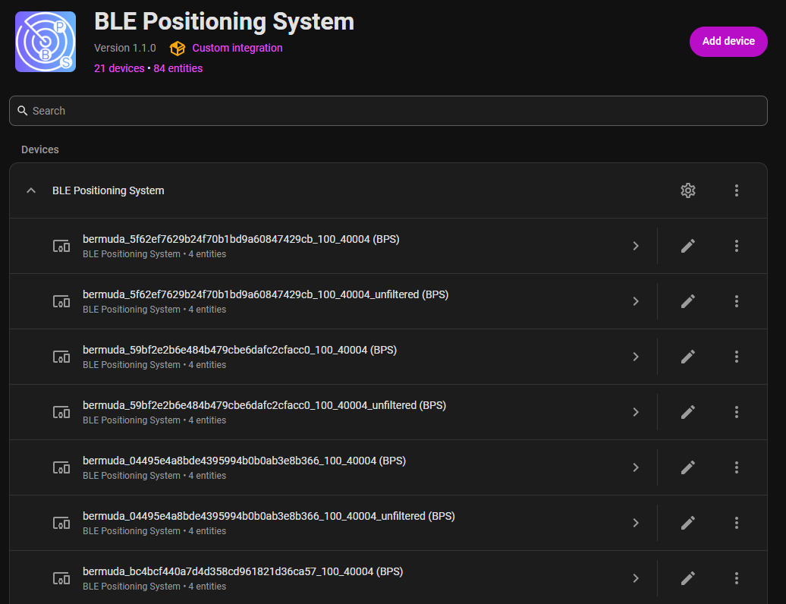

Only genuine Bermuda trackers get BPS sensors: entities from other integrations
that merely expose a `_distance_to_*` sensor (for example an mmWave presence
sensor's `_distance_to_detection_object`) are no longer mistaken for trackers.

## Positions stay on the map

Noisy BLE readings used to let the solver place a device far outside the floor
plan, or in the dead space between rooms. This fork constrains positioning in
two ways:

- The trilateration solver is **bounded to the floor** (the extent of its
  receivers and zones), so a fix can never leave the map — when an
  unconstrained solve would escape, the result lands on the boundary instead.
- A fix that still sits outside every zone is **snapped to the nearest point of
  the nearest zone** before it's published.

The map card, `/api/bps/cords`, and the zone sensors all see the same corrected
position.

## Away detection

Previously a person who left home stayed frozen on the map at their last
position indefinitely, with the zone and floor sensors stuck at their last
values.

Now a tracker that **no receiver has detected for 5 minutes** disappears from
the map, and its `_bps_zone`, `_bps_floor` and `_bps_nearest_zone` sensors go
to `unknown`. It reappears on the first fix once it's back in range. Tune the
grace period with a top-level `"position_timeout"` (seconds) in `bpsdata.txt`.

(For a faster "out of range" signal, `_bps_nearest_zone` already reacts within
~30 s — Bermuda's own distance timeout — while the map position keeps the
5-minute grace so brief detection gaps don't blink people off the map.)

## Reliable across reboots

BPS used to stop producing data after a full restart until you manually
reloaded the integration. The sensors are now recreated correctly on boot even
when their registry entries survived an unclean shutdown, and BPS cancels its
background tasks promptly at shutdown so restarts stay clean.

---

## Modern, dark, zoomable panel

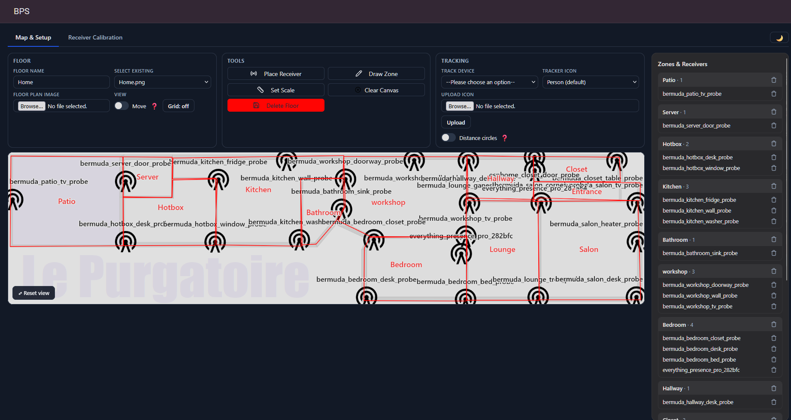

The BPS side panel was reworked into a modern, dark-themed layout split across
three tabs — **Map & Setup** (the floor plan, tools, and tracking), **Receiver
Calibration** (the matrix, on its own tab so it no longer crowds the setup
page), and **[Debugging](#debugging-tab)** (the full receiver-to-Bermuda linking
picture). The map itself is interactive:

- **Zoom** with the mouse wheel (cursor-centered, 1×–8×) and **pan** by
  dragging. A **Reset view** button sits in the lower-left corner. Zooming and
  panning never change your placed coordinates — it's purely a view.
- **Distance grid** overlay (toggle in the toolbar), spaced from the floor's
  calibration scale, in **meters or feet**. Grid labels stay pinned to the
  visible edges and readable at any zoom.
- **Zones & Receivers sidebar** replaces the old floating list: one section per
  zone, with the receivers that physically sit inside each zone listed under it,
  plus a delete button on every row.
- If you have a **single floor**, the panel opens straight onto it. The **Select
  existing** floor dropdown lists floors by their **name**, not the image
  filename.
- **Zone names** are centered in their room. **Receiver names are hidden by
  default** so they can't pile up on top of one another — hover a receiver's icon
  (or its row in the Zones & Receivers sidebar), or focus it, to reveal its full
  name.

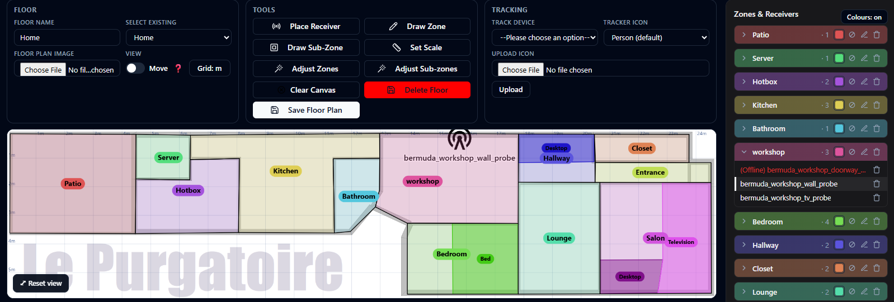

### Moving and focusing receivers

- A **Move receivers** toggle (off by default) controls dragging. With it on,
  drag a receiver to reposition it, then **Save Floor Plan**. With it off,
  dragging pans the map.
- With Move off, **clicking a receiver focuses it** — only that receiver, its
  distance circle, and the tracked device stay on the map, so you can study one
  receiver's contribution. Click it again, or click empty space, to show
  everything.
- You can also **click a receiver's row in the Zones & Receivers sidebar** to
  focus it — the same effect as clicking its icon. The focused row is
  highlighted, and clicking it again clears the focus.


### Offline receivers

A receiver the system can't currently reach is flagged **in red** in the panel:
its **Zones & Receivers row** and its **map label** read `(Offline) <name>`, and
— when distance circles are off — the **beacon icon itself turns red**. The
markers refresh live, without reloading the panel.

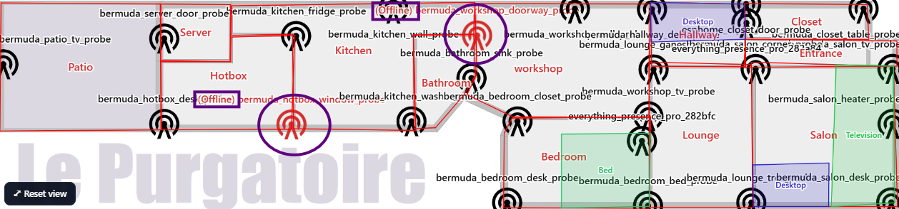

"Offline" here means the proxy is actually down, not merely that no tracked
device is near it: the panel uses the same automatic tiers as the
[map card](#receivers-on-the-map-card) — Bermuda scanner liveness, then a
`connectivity` status sensor, then the proxy's Home Assistant device
availability — so a probe that drops off the map only because everyone left the
house is *not* flagged.

### Light or dark theme

The panel opens in dark mode, but a **theme toggle** (🌙 / ☀️) at the right of
the tab bar flips the whole panel — map, sidebar, toolbar, and the calibration
matrix — between dark and light. Your choice is remembered across reloads.

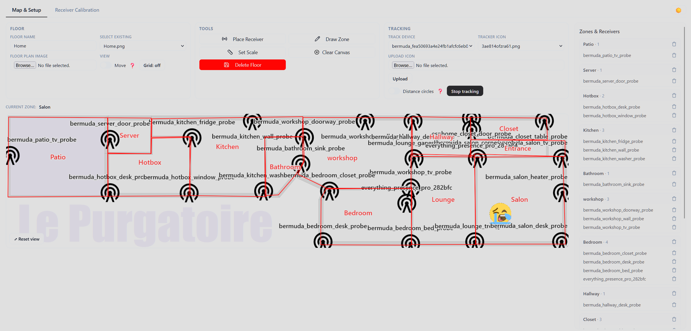

### Ultrawide layouts

The panel uses the full width of the window at every resolution. On a very wide
screen (32:9 and similar) it goes a step further and reflows into three
columns — the Floor, Tools, and Tracking cards stacked on the left, the map
enlarged in the center, and the Zones & Receivers list on the right — so nothing
is cramped and the map gets the space it deserves.

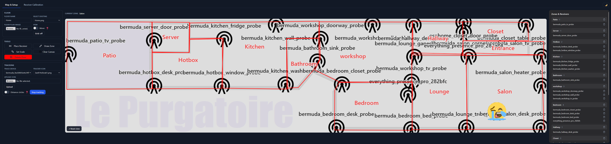

## Polygon zones

Zones are no longer limited to rectangles. When drawing a zone:

- **Click the floor plan to place each corner**, one by one — any shape with
  three or more corners, including L-shaped rooms.
- **Drag a corner** to adjust it, or **drag inside the zone** to move the whole
  shape. Dragging is clamped so a corner can never end up off-screen (the old
  trap where an off-canvas handle became ungrabbable).
- **Right-click a corner to delete it** (right-clicking empty space removes the
  last corner you placed); deleting the last remaining corner cancels the shape.
  A zone needs at least three corners to be saved.

Zones drawn with the old rectangle tool keep working unchanged.

**Editing a saved zone:** click the ✎ pencil next to a zone in the **Zones &
Receivers** sidebar to reopen it in the editor — drag its corners, drag the whole
shape, add or right-click-delete corners, then **Save Zone**.

## Sub-zones

Sub-zones are smaller polygons drawn **inside** a zone — a couch, a bed, a desk,
a reading nook — for when "which room" isn't precise enough.

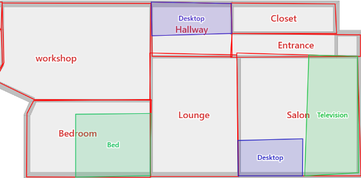

- Click **Draw Sub-Zone**, then click inside the zone you want it in (that becomes
  its **parent**) and place corners just like a zone. Every corner is **kept inside
  the parent zone**, and each sub-zone is drawn in its own shade of the parent's
  colour (see [Zone colours](#zone-colours)). Sub-zones are editable the same way
  zones are (✎ pencil in the sidebar).
- Sub-zones are listed under their parent in the sidebar, each with edit and delete
  buttons; deleting a zone removes its sub-zones with it.
- Each tracked device gets a **`sensor.<device>_bps_sub_zone`** entity whose state
  is the sub-zone it is currently in (`unknown` when in none), with a
  **`parent_zone`** attribute naming the enclosing zone.
- The Lovelace map card can draw sub-zones too — enable **Show sub-zones**
  (`show_sub_zones: true`) in the card config.

## Zone colours

Every zone is tinted its own colour on the panel map — a light translucent fill
with a solid **black outline** — and the room name sits in a **colour pill** (the
zone's colour at full opacity, black text) so it stays legible over any fill.
Colours are assigned automatically, so no two zones look alike.

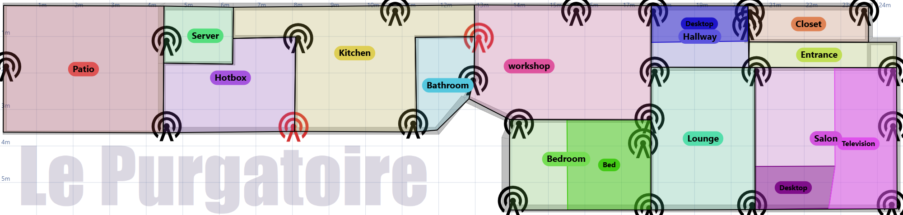

- **Sub-zones** are drawn in **shades of their parent zone's colour**, each sibling
  a distinct shade, so you can tell them apart while still reading them as "part of
  that room."
- **Pick a colour** for any zone from the swatch beside it in the **Zones &
  Receivers** sidebar, or **remove** a zone's colour to leave it plain.
- The sidebar's zone headers are tinted to match the map.
- A **`Colours: on` / `Colours: off`** button in the sidebar header hides or
  restores every zone colour at once, for when you want a plain map.

Colouring is purely cosmetic — it never changes zone geometry or any sensor.

## Adjust zones

Hand-drawn rooms rarely line up: walls overlap a little, corners miss by a few
centimetres, and rooms meant to be square aren't quite. Two buttons clean this
up — **Adjust Zones** for the main rooms and **Adjust Sub-zones** for the areas
inside them — each with its own preview, so the two are never actuated at once.

**Adjust Zones** squares rooms that are already nearly rectangular, snaps
neighbours so they share edges (both at shared corners and where a corner meets
the middle of a wall), and removes overlaps.

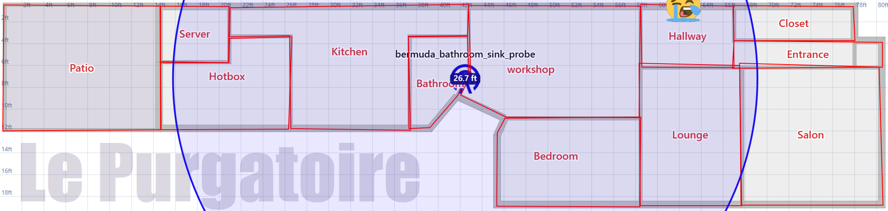

Clicking **Adjust Zones** draws the proposal as a **green dashed overlay** on top
of your current zones, with a control bar — a **Snap** slider (how large a
gap/overlap to close, in cm), a **Square rooms** toggle, and **Cancel** /
**Apply** — plus a summary of what changed. Moving the slider re-previews live.

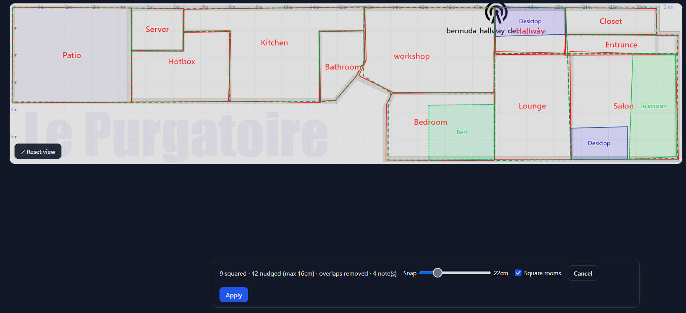

**Apply** writes the proposal into the floor; nothing is persisted until you
click **Save Floor Plan** (reloading discards it).

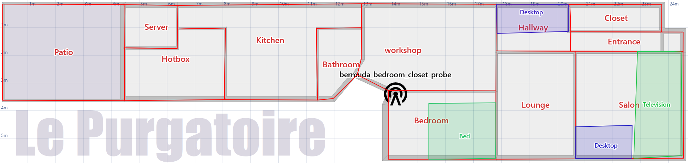

It is deliberately **conservative**: only rooms already close to rectangular are
squared (L-shaped and diagonal rooms are left alone), only gaps small enough to
be drawing slop are closed (a real gap — say, to a closet — is kept), and it
never invents area. Contested overlaps go to the larger room. If a result isn't
what you want, **Cancel** and lower the Snap tolerance.

**Adjust Sub-zones** does the same for the smaller areas, one parent room at a
time: it squares each sub-zone, snaps it to its parent's walls and to its
siblings, removes overlaps between siblings, and clamps each one inside its
parent. Run it after adjusting zones if a room moved and left a sub-zone poking
out.

## Pre-populated receiver picker

Placing a receiver no longer means typing its Bermuda scanner name from memory.
You now pick it from a **searchable dropdown of every receiver Bermuda currently
reports** (derived from the `sensor.*_distance_to_*` entities) — type to filter
the list — with a "Custom name…" option for receivers Bermuda hasn't seen yet.

Receivers already placed on **any** floor are hidden from the list — a receiver
belongs to exactly one floor, and placing the same one on several floors would
make those floors compete for the tracker.

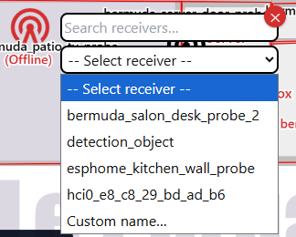

## Debugging tab

A third panel tab, **Debugging**, shows the full picture of how BPS is wired to
Bermuda right now — the tool to reach for when a device won't place or a receiver
seems ignored. It's a live snapshot; press **Refresh** to re-check. It has two
sub-tabs, both laid out as tables.

**Receivers** lists every placed receiver with its floor, a status chip
(**Live** / **No reading** / **Unmatched**), its hardware token, and the per-device
Bermuda distance sensors feeding it. Each sensor is a pill showing the device and
its current reading, coloured by state:

- **green** — a live distance,
- **amber** — matched but no value right now (usually just no recent BLE contact),
- **bright orange-red** — `unavailable` (the entity is actually gone).

A summary counts Live / No reading / Unmatched, and a second table lists scanners
that carry distance sensors but aren't placed on any floor. Together this makes it
easy to tell a real naming mismatch (**Unmatched** — no distance sensor carries
that name) apart from a receiver that's linked correctly but simply quiet
(**No reading**).

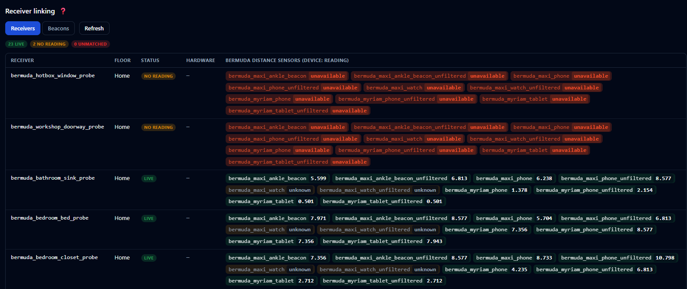

**Beacons** is the inverse view: one row per tracked device (beacon), with the
receivers currently detecting it listed **closest first** as distance pills.
Beacons that nothing detects sort to the top with a **None** status, so a device
that's dropped off the system stands out at a glance.

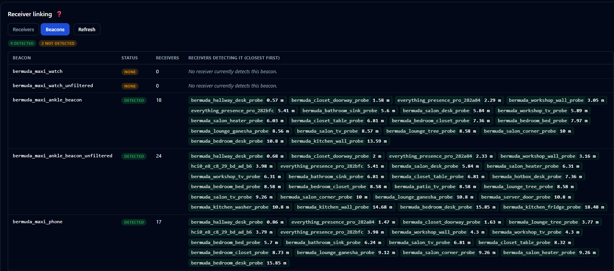

(The Map & Setup tab keeps a compact heads-up of any receivers that are linked but
not reporting right now; the Debugging tab is where the full per-entity detail
lives.)

---

## Receiver auto-calibration

BLE distance estimates vary per receiver (antenna, enclosure, mounting, TX
power). This fork can measure and correct that automatically — the same idea as
ESPresense-companion's node calibration, but with zero manual configuration.

The receivers calibrate **each other**: every probe advertises an iBeacon, so
its siblings range it, and comparing those probe-to-probe distances against the
receivers' placed positions reveals each receiver's error.

### Prerequisite: make each probe advertise

Add one block to your ESPHome proxies. The whole fleet shares the UUID; make the
`minor` unique per probe (deriving it from the static IP's last octet needs no
per-device edits):

```yaml
esp32_ble_beacon:
  type: iBeacon
  uuid: fde3b150-2f64-43ba-aee9-867f75ee4a6f
  major: 1
  minor: ${ static_ip.split('.')[3] | int }
  min_interval: 500ms
  max_interval: 1000ms
```

Nothing needs to be set up in Bermuda — BPS reads the probe-to-probe
measurements through the `bermuda.dump_devices` service.

### Running it

In the panel's **Receiver Calibration** section, select a floor and start a run
(10 minutes is a good default). The result is a matrix: rows transmit, columns
receive; **blue cells measure short, red cells measure long**. Through-wall
pairs showing red is expected — walls only lengthen BLE estimates, and the fit
accounts for that by trusting each receiver's cleanest paths and the wall-free
difference between the two directions of every pair. Receivers flagged ⚠ got an
aggressive correction or had too few usable pairs (typically no line of sight to
any sibling) — verify their placement before applying.

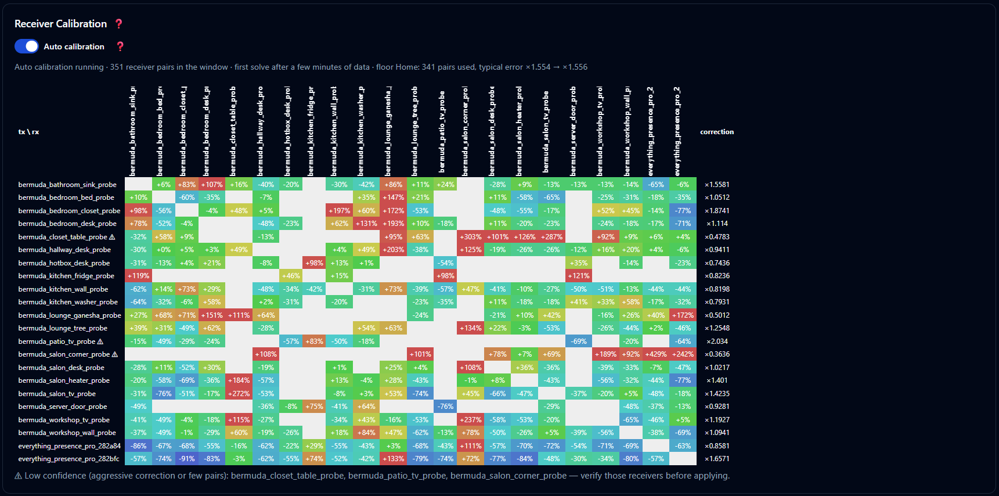

**Apply corrections** stores a per-receiver factor in `bpsdata.txt`, and the
backend multiplies every distance that receiver reports from then on. Because
Bermuda's path-loss model is exponential, this is exactly equivalent to a
per-scanner RSSI offset — and the result lists the equivalent Bermuda
"Calibration 2" `rssi_offset` per scanner if you'd rather calibrate at the
source. Corrections are **relative** (normalized so they never rescale all
distances at once); the absolute scale stays with Bermuda's own
`ref_power`/`attenuation`. **Reset corrections** removes them.

### Auto calibration

Toggle **Auto calibration** and it runs permanently: sampling every 30 seconds
into a rolling ~6-hour window, re-solving every 15 minutes for every floor, and
re-applying corrections whenever they shift by more than 1%. It keeps adapting
as the environment changes (furniture moves, a probe is swapped, a door stays
open). The toggle is stored in `bpsdata.txt` (alongside the corrections), while the
latest solve and the rolling sample window are persisted separately in
`bps_calibration_state.json`. So after a restart the toggle sticks, the matrix
reappears immediately, and the window resumes warm instead of rebuilding from
zero.

## Kalman position smoothing

Published positions used to be smoothed with a fixed 3-sample moving average —
every fix weighted equally, so the map always trailed a walking person by the
same lag, still or moving. That average is replaced by a **constant-velocity
Kalman filter** (the same family of filtering ESPresense and other BLE
positioning projects apply to their signals, applied here at the position
level, since Bermuda already smooths the distances BPS reads):

- The filter carries a velocity estimate, so while you walk it **predicts along
  your motion** instead of dragging behind the average of old fixes — and while
  you're still it trusts its accumulated estimate and **damps jitter harder**
  than a 3-sample mean ever could.
- Its noise model is defined in **metres** and converted through each floor's
  scale, so smoothing behaves identically on floor plans of any resolution.
- The state resets whenever the tracker changes floors, goes out of range, or
  is pruned — no ghost velocity carrying over from before an absence.

The spike gate feeding the solver got smarter too: a receiver whose distance
jumped since the last update used to be **discarded outright** (a hard 50%
cut-off), which could starve the solver below the three receivers it needs —
precisely while you were walking, when every distance legitimately changes.
Spiky readings are now **down-weighted instead of dropped**: the solver keeps
every receiver, trusting sudden jumps proportionally less.

## Trilateration visualization

During tracking, a **Distance circles** toggle draws each receiver's measured
distance as a circle around it — the tracked device sits where the circles
intersect, which makes the trilateration (and any mis-calibrated receiver)
visible at a glance.

- Each receiver's **icon takes the color of its circle**, so you can tell which
  circle belongs to which receiver even when they overlap.
- Each receiver carries a **pill showing the measured distance** (in the grid's
  unit — meters or feet).
- The circles and distances are the **exact radii the solver used**, including
  any calibration corrections — not a separate estimate.

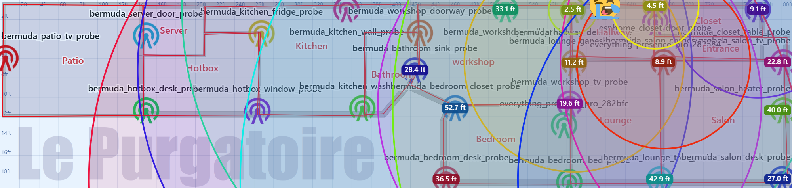

## Trace path

A second tracking toggle, **Trace path**, draws the route the tracked device
has taken since the session started — handy for judging how stable and
responsive the positioning really is (does the path hug the hallway, or
zig-zag through walls?).

- The path **fades with age**: the newest stretch is brightest, so the
  direction of travel reads at a glance. A dot marks where the session began.
- It draws **on top of everything** — distance circles included — so it stays
  visible with both debugging overlays on.
- Fixes are recorded for the whole session even while the toggle is off, so
  flipping it on mid-session shows the full route so far. Starting a new
  session clears the previous trace.
- Only fixes belonging to the floor on screen are drawn; a stretch spent on
  another floor breaks the line instead of connecting through it.

Like Distance circles, the toggle appears only during an active tracking
session, is **off by default**, and remembers its state.

It makes the value of clean distance data obvious. Below is the **same ankle
beacon** tracked at once on Bermuda's **unfiltered** vs **filtered** distance:
the unfiltered feed (`…_unfiltered`, centre) smears into a jittering tangle
that never settles, while the filtered feed (lower-right) holds a stable,
accurate fix — a stark reminder to track the filtered distance, and to keep
receivers well calibrated (see [Receiver distances](#receiver-distances)).

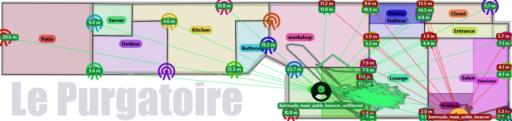

## Receiver distances

A **Receiver distances** toggle in the Tracking column draws a line between
every pair of receivers that measure each other, straight on the floor plan.
**Hover a line (or a receiver)** to read a pill with **`measured (real)`** — the
distance the receivers measure between themselves (after calibration
corrections) next to the true map distance between their placed positions. The
pills stay hidden until you hover so a dense floor's colour map stays readable;
the lines themselves are the at-a-glance signal. While you hover, every **other**
line dims to 10% so the one path (a hovered line, or all of a hovered receiver's
links) stands out of the mesh.

- Lines take the **calibration table's colour code**: green measures
  accurately, red measures long, blue measures short — a mis-behaving receiver
  stands out at a glance. A two-way link is coloured by its **worse
  direction**, so a receiver that only transmits badly can't average itself
  green. A **legend** overlaid on the map's top-left spells the gradient out.
- A **grey dashed line** means one of its receivers was moved after the last
  solve: the old judgement would be meaningless over the new geometry, so the
  pill switches to the live map distance and asks for a recalibration instead.
- A **Closest selector** next to the toggle limits how many lines each
  receiver contributes (its 1–5 nearest neighbours by map distance, or all
  links) — on a dense floor the full mesh is a lot of lines.
- A **colour selector** filters by calibration result: show only the accurate
  (green), too-short (blue), or too-long (red) links, or every off-colour one
  (red **and** blue together) to see just the receivers that need attention.
- A **distance selector** switches the detected distance between **Calibrated**
  (after the per-receiver correction — the residual error) and **Raw** (the
  uncorrected reading — the sensor's own error). It drives both the pill value
  and the line colour, so flipping it shows exactly what calibration is doing:
  a link that's red raw and green calibrated is one the correction fixed.
- **Click a receiver** to declutter: only that receiver and the lines to the
  receivers it exchanges measurements with stay visible. Click a neighbour to
  move the focus there; click the focused receiver again (or empty space) to
  show everything.
- **Click a line or its distance pill** to isolate that single link — it's
  drawn highlighted and every other line is hidden, so you can read one pair
  without the surrounding mesh. Click it again, or an empty spot, to show all.
- The values come from the **latest calibration solve** for the floor (run one
  from the Calibration tab, or leave auto calibration on to keep them fresh);
  distances honour the grid's unit (meters or feet), and the pills stay a fixed
  on-screen size while you zoom, like every other distance pill.
- Unlike the two toggles above it needs **no active tracking session**; it is
  off by default and remembers its state.

---

## Receivers on the map card

The Lovelace map card can now draw your receivers (bluetooth proxies), colored
by whether they're working:

```yaml
type: custom:bps-map-card
floor: first
entities:
  - sensor.eriks_iphone_16
show_receivers: true
show_receiver_labels: true   # optional: print the receiver name next to the icon
scale_receiver_icon: 100     # optional: receiver icon size (defaults to scale_icon)
scale_receiver_labels: 75    # optional: receiver label size (defaults to scale_labels)
receiver_status:             # optional: explicit status entity per receiver
  nsp_kitchen: binary_sensor.nsp_kitchen_status
```

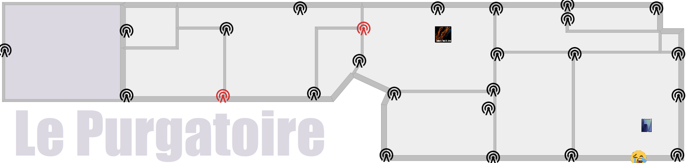

The beacon icon is drawn **black when the receiver is working** and **red when
it is offline/unavailable**. The decision is made per receiver, first match
wins:

1. **`receiver_status` mapping** (if given): the mapped entity decides — an
   offline-like state (`off`, `unavailable`, `unknown`, `none`, `false`,
   `not_home`, `offline`, `disconnected`, or empty) shows red, anything else
   black. Any entity of the device works (e.g. an uptime sensor). Map a receiver
   to `false` (or `heuristic`) to skip tiers 2–4 and force the distance
   heuristic.
2. **Bermuda scanner liveness** (automatic): the card asks Bermuda
   (`bermuda.dump_devices`) and matches scanners to receivers by name. A
   receiver is working while its scanner heard *any* advertisement within
   `receiver_timeout` seconds (default 30, min 10). This is the strongest tier —
   it catches a proxy whose BLE scanning died while its network stayed up.
3. **`binary_sensor.<receiver>_status`** with device class `connectivity` — the
   conventional ESPHome `status` sensor.
4. **Device availability** (automatic): the HA device whose name matches the
   receiver is online while any of its entities isn't `unavailable`. A
   connectivity-class entity of that device is authoritative.
5. **Bermuda distance sensors** (fallback): working while at least one
   `sensor.*_distance_to_<receiver>` reports a distance (Bermuda holds the last
   reading ~30 s), so a dead — or unreachable — proxy turns red after about half
   a minute.

Tiers 2–4 need no configuration and match by the receiver name you used in the
panel (normally the proxy's HA device name). If a receiver shows red while the
device is online, map it explicitly in `receiver_status`.

The full card guide (all options, per-floor behavior, labels/icons/zones,
troubleshooting) is in the [upstream wiki](https://github.com/Hogster/BPS/wiki/Lovelace-map-card).

---

## Feedback & contributions

Issues and pull requests for these additions are welcome on
[maxi1134/BPS-improved](https://github.com/maxi1134/BPS-improved). For the core integration and
general BPS discussion, see [Hogster/BPS](https://github.com/Hogster/BPS) and
the [Home Assistant Community thread](https://community.home-assistant.io/t/bps-the-indoor-precise-tracking-system/843429).

This is teamwork on top of two great projects — [Bermuda](https://github.com/agittins/bermuda)
by [@agittins](https://github.com/agittins) and [BPS](https://github.com/Hogster/BPS)
by [@Hogster](https://github.com/Hogster). Improving Bermuda's precision and
stability benefits BPS directly.
