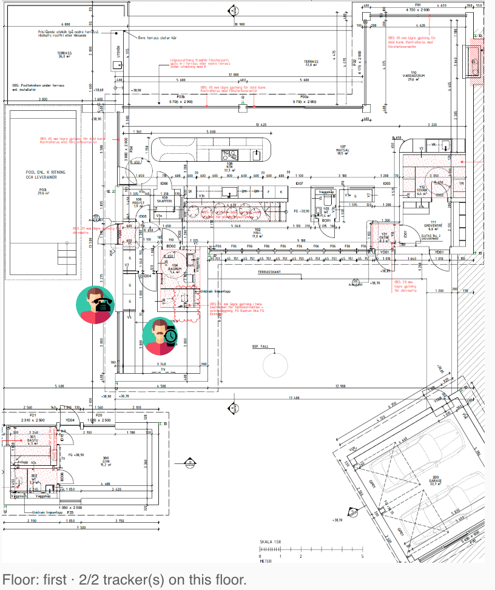

## SciPy dependency

This integration depends on SciPy, which requires native binary support.

- Supported: Home Assistant installations running on 64-bit systems (e.g. aarch64 / ARM64 or x86_64)
- Not supported: 32-bit systems (e.g. ARMv7)

Note:
Even on supported hardware (such as Raspberry Pi 4/5 with 64-bit OS), installation may fail depending on the Home Assistant environment, since SciPy cannot always be installed inside the restricted Python environment used by Home Assistant.

If you encounter issues, consider running Home Assistant in a container where you control the Python environment.


# BLE Positioning System (BPS)
A BLE positioning sytem for Homeassistant providing realtime, multi device, floor plan tracking indoors. Dependent on the Bermuda component built by @agattins. 

[](https://my.home-assistant.io/redirect/hacs_repository/?owner=Hogster&repository=BPS&category=Integration)

Follow the discussion on [Home Assistan Community](https://community.home-assistant.io/t/bps-the-indoor-precise-tracking-system/843429)

- Precisely track your bluetooth devices (indoors) using [bluetooth_proxy] [ESPHome](https://esphome.io/) (https://esphome.io/components/bluetooth_proxy.html) devices in [HomeAssistant](https://home-assistant.io/).

[![GitHub Release][releases-shield]][releases]
[![GitHub Activity][commits-shield]][commits]
[![License][license-shield]](LICENSE)

[![pre-commit][pre-commit-shield]][pre-commit]

[![hacs][hacsbadge]][hacs]
[![Project Maintenance][maintenance-shield]][user_profile]
[![BuyMeCoffee][buymecoffeebadge]][buymecoffee]

[![Discord][discord-shield]][discord]
[![Community Forum][forum-shield]][forum]

## What it does:

BLE Positioning System (BPS) continues on the great work by [@agittins](https://github.com/agittins) and his [Bermuda](https://github.com/agittins/bermuda).
Based on Bermudas ability to, in near-realtime, estimate distance to ESPHome devices running bluetooth_proxy BPS can leverage this information and by trilaterate give a precise position.


By exactly placing the location of the bluetooth_proxy devices as well as defining specific zones, BPS can show:
- Where exactly a device is located on a floorplan (like a GPS on a map)
- Determine which floor you are currently on. Gives the ability to automate when changing floor.
- Determine which zone (Kitchen, Bedroom etc.) a device is currently in. Gives the ability to automate based on specific devices entering or leaving a zone. 

This is done for all devices you track with Bermuda so you can track different persons or objects and automate based on this.

For my specific purpose I Sonoff NS Panels in all rooms of my house which I run esphome on. This together with other stationary bluetooth proxies I have good coverage to do trilataration.

Bermuda aims to let you track any bluetooth device, and have Homeassistant tell you where in your house that device is. The only extra hardware you need are esp32 devices running esphome that act as bluetooth proxies. Alternatively, Shelly Plus devices can also perform this function.

## What you need:

- Home Assistant up and running (duhh!)

- Bermuda [bermuda] installed and tracking at least one bluetooth device
- At least three devices providing bluetooth proxy information to HA using esphome's `bluetooth_proxy` component. (it needs data from three devices to be able to track so if you only have three devices and you loose one due to distance it is not able to track)

@agittins writes on the Bermuda readme:
"  I like the D1-Mini32 boards because they're cheap and easy to deploy.
  The Shelly Plus bluetooth proxy devices are reported to work well.
  Only natively-supported bluetooth devices are supported, meaning there's no current or planned support for MQTT devices etc.

- USB Bluetooth on your HA host is not ideal, since it does not timestamp the advertisement packets.
  However it can be used for simple "Home/Not Home" tracking, and Area distance support is enabled currently."

  I can from my own experience add NS Panel since I use them all around the house as replacement for wall switches and thus get great coverage.


- Install BPS via HACS: [](https://my.home-assistant.io/redirect/hacs_repository/?owner=Hogster&repository=BPS&category=Integration)

## Documentation and help - the Wiki

See [The Wiki](https://github.com/Hogster/BPS/wiki/) for more info on how it works and how to configure for your home.

## Screenshots

After installing, the integration should be visible in Settings, Devices & Services


The integration has now, if you are tracking devices, created 3 sensors for each device you are tracking:

- `sensor.<device>_bps_floor` — the floor the device is on.
- `sensor.<device>_bps_zone` — the zone the device is in; `unknown` when the
  position falls outside every zone (trilateration jitter can land a fix
  between two zones or off the map).
- `sensor.<device>_bps_nearest_zone` — always the *closest* zone on that
  floor, even when the fix is between zones or outside the map; inside a zone
  it matches `_bps_zone`.

Positions can never leave the floor: the trilateration solver is bounded to
the extent of the floor's receivers and zones, and a fix that still lands
outside every zone (BLE noise pushing it into a wall or off the apartment) is
published at the nearest point on the nearest zone instead — on the map card,
in `/api/bps/cords`, and for the zone sensors alike.

A tracker that no receiver has detected for 5 minutes disappears from the map
and its `_bps_zone`, `_bps_floor` and `_bps_nearest_zone` sensors go to
`unknown` (previously the last position and zone were kept forever after
someone left home). The grace period can be tuned with a top-level
`"position_timeout"` (seconds) in `bpsdata.txt`.


You will now also have a new panel in the side panel named "BPS"


The BPS panel for tracking is used for placing receivers (Bluetooth_Proxy devices) and defining zones. Zones are polygons: click the floor plan to place corners one by one (three or more, any shape — L-shaped rooms included), drag a corner to adjust it, drag the inside of the zone to move the whole thing, right-click to remove the last corner. Zones drawn with the old rectangle tool keep working. When placing a receiver you pick its name from a pre-populated list of every receiver Bermuda currently reports (derived from the `sensor.*_distance_to_*` entities), so there is no need to type the name by hand — a "Custom name…" option is still available for receivers Bermuda has not seen yet. Receivers already placed on any floor are hidden from the list: a receiver belongs to exactly one floor, and placing the same one on several floors would make those floors compete for the tracker. During tracking, the **Distance circles** toggle draws every receiver's measured distance as a colored circle around it — the device sits where the circles intersect, which makes the trilateration (and any badly calibrated receiver) visible at a glance. The circles use the exact radii the solver used, including calibration corrections. The "real-time" tracking is more to get a sense about what i happening and a form of debugging. You will notice where you have good precision as well as worse. And thus can give you an idea where to add devices for improved tracking.


## Receiver calibration

BLE distance estimates vary per receiver (antenna, enclosure, mounting). The
panel's **Receiver Calibration** section measures how far the receivers think
they are *from each other*, compares that with their placed positions on the
floor plan, and fits a per-receiver distance correction — the same idea as
ESPresense-companion's node calibration.

Prerequisite: each probe must advertise an iBeacon so its siblings can range
it. On ESPHome probes this is one block (the fleet shares the UUID; make the
`minor` unique per probe, e.g. from the last octet of its static IP):

```yaml
esp32_ble_beacon:
  type: iBeacon
  uuid: fde3b150-2f64-43ba-aee9-867f75ee4a6f
  major: 1
  minor: ${ static_ip.split('.')[3] | int }
  min_interval: 500ms
  max_interval: 1000ms
```

Nothing needs to be configured in Bermuda: BPS reads the probe-to-probe
measurements through the `bermuda.dump_devices` service.

Select a floor, start a run (10 minutes is a good default), and review the
matrix: rows transmit, columns receive; blue cells measure short, red cells
measure long. Through-wall pairs showing red is normal — walls only lengthen
BLE distance estimates, and the fit accounts for that by trusting each
receiver's cleanest paths and the wall-free difference between the two
directions of every pair. Receivers flagged ⚠ got an aggressive correction or
had few usable pairs (typically a receiver with no line of sight to any
sibling); verify their placement before applying.

**Apply corrections** stores a factor on each receiver in `bpsdata.txt` and
the backend multiplies every distance that receiver reports from then on
(because Bermuda's path-loss model is exponential, this is exactly equivalent
to a per-scanner RSSI offset). Corrections are relative — normalized so they
never rescale all distances at once; the absolute scale stays with Bermuda's
own `ref_power`/`attenuation` calibration. **Reset corrections** removes them. The result
also lists the equivalent Bermuda "Calibration 2" `rssi_offset` per scanner if
you prefer to calibrate at the source for all integrations at once.

**Auto calibration** keeps this running permanently: the backend samples every
30 seconds into a rolling window (about six hours), re-solves every 15 minutes
for **every** floor at once, and re-applies corrections automatically whenever
they change by more than 1%. The toggle is stored in `bpsdata.txt`, so it
survives Home Assistant restarts. With auto calibration on, the manual
controls are hidden — the matrix in the panel simply tracks the latest solve
for the selected floor, and corrections keep adapting as the environment
changes (furniture moves, probes are swapped, a door stays open).

## Lovelace card (BPS Map)

You can show one floor plan and multiple tracked devices on a dashboard card, with one card per floor.



Quick start:

1. Add a **Dashboard resource** (Settings → Dashboards → ⋮ → Resources):
   - **URL**: `/bps/bps-map-card.js`
   - **Resource type**: JavaScript module
2. Add a card in YAML mode:

```yaml
type: custom:bps-map-card
floor: first
entities:
  - sensor.eriks_iphone_16
  - sensor.eriks_apple_watch
poll_interval: 3
```

### Showing receivers on the card

With `show_receivers: true` the card also draws the receivers (bluetooth proxies)
you placed on this floor in the BPS panel. The beacon icon is drawn **black**
when the receiver is working and **red** when it is offline/unavailable.

```yaml
type: custom:bps-map-card
floor: first
entities:
  - sensor.eriks_iphone_16
show_receivers: true
show_receiver_labels: true   # optional: print the receiver name next to the icon
scale_receiver_icon: 100     # optional: receiver icon size (defaults to scale_icon)
scale_receiver_labels: 75    # optional: receiver label size (defaults to scale_labels)
receiver_status:             # optional: explicit status entity per receiver
  nsp_kitchen: binary_sensor.nsp_kitchen_status
```

The working/offline decision is made per receiver, first match wins:

1. **`receiver_status` mapping** (if given): the mapped entity decides — states
   such as `off`, `unavailable`, `unknown`, `not_home` or `offline` show the
   receiver in red, anything else in black. Any entity of the device works
   (e.g. an uptime sensor: it goes `unavailable` when the device drops off).
   Mapping a receiver to `false` (or `heuristic`) instead of an entity skips
   steps 2-4 and forces the distance heuristic for that receiver.
2. **Bermuda scanner liveness** (automatic): the card asks Bermuda directly
   (`bermuda.dump_devices`) and matches scanners to receivers by name. A
   receiver is working while its scanner heard *any* BLE advertisement within
   `receiver_timeout` seconds (default 30, minimum 10) — the same signal as
   the scanner table in Bermuda's configure dialog. This is the strongest
   tier: it proves the proxy is actually receiving, and catches a proxy whose
   BLE scanning died while its network connection stayed up.
3. **`binary_sensor.<receiver>_status`** (if that entity exists with device
   class `connectivity`): the conventional ESPHome `status` sensor.
4. **Device availability** (automatic): the HA device whose name matches the
   receiver is online while any of its entities is not `unavailable` — an
   uptime sensor is enough. If the device has a connectivity-class entity
   (like the ESPHome `status` sensor), that entity's state decides instead,
   since ESPHome keeps it available (state `off`) when the device dies.
5. **Bermuda distance sensors** (fallback): the receiver counts as working when
   at least one `sensor.*_distance_to_<receiver>` entity reports a distance.
   Bermuda keeps the last reading for roughly 30 seconds (its distance timeout)
   before the sensor goes to `unknown`, so a dead proxy — or a live proxy that
   no tracker can currently reach — turns red after about half a minute.

Tiers 2-4 need no configuration. Tier 2 requires a Bermuda version that
supports service response data; when unavailable the card silently falls
through. Tiers 2 and 3 match by name: they follow the receiver name you used
in the BPS panel, which normally equals the proxy's device name in HA. If a
receiver still shows red while the device is online, map it explicitly in
`receiver_status`.

The full card guide (all options, per-floor behavior, labels/icons/zones, and troubleshooting) is in the wiki:
- [Wiki: Lovelace map card](https://github.com/Hogster/BPS/wiki/Lovelace-map-card)

## TODO / Ideas

- [ ] Improve the GUI (adding circles around the receivers for showing the distance and thus where the intersections are i.e. visualizing the trilataration)
- [x] Be able to create zones that are not square (zones are polygons: click to place corners, drag corners or the whole zone)
- [ ] Improve speed and performance in general
- [x] Create a Lovelace card with a map showing tracked devices
- [ ] And more...

## Feed back

To set the stage. I'm not a programmer and not even close to have this as a profession. I'm just a hobyist who love home automation and built this out of the urge to be able track people in realtime.
Do you think there is room to improve or in any other way add to the experience. GREAT! Please contribute or let me know.

Again, this work is only possible due to the great work by [@agittins](https://github.com/agittins) and his [Bermuda](https://github.com/agittins/bermuda). This is a teamwork, if we can improve Bermuda's abilties (precision & stability) BPS will also greatly benefit.


## Prior Art

There are other like [Bermuda](https://github.com/agittins/bermuda), `bluetooth_tracker`, `ble_tracker` and ESPresense. 
The `bluetooth_tracker` and `ble_tracker` integrations are only built to give a "home/not home"
determination, and don't do "Area" based location. (nb: "Zones" are places outside the
home, while "Areas" are rooms/areas inside the home). I wanted to be free to experiment with
this in ways that might not suit core, but hopefully at least some of this could find
a home in the core codebase one day.

The "monitor" script uses standalone Pi's to gather bluetooth data and then pumps it into
MQTT. It doesn't use the `bluetooth_proxy` capabilities which I feel are the future of
home bluetooth networking (well, it is for my home, anyway!).

ESPresense looks cool, but I don't want to dedicate my nodes to non-esphome use, and again
it doesn't leverage the bluetooth proxy features now in HA. I am probably reinventing
a fair amount of ESPresense's wheel.

## Installation

Definitely use the HACS interface! Once you have HACS installed, go to `Integrations`, click the
meatballs menu in the top right, and choose `Custom Repositories`. Paste `Hogster/BPS` into
the `Repository` field, and choose `Integration` for the `Category`. Click `Add`.

You should now be able to add the `BLE Positioning Sytem` integration. Once you have done that,
you need to restart Homeassistant, then in `Settings`, `Devices & Services` choose `Add Integration`
and search for `BLE Positioning Sytem` or 'BPS'. 

Once the integration is added, you need to set up your devices by clicking `Configure` in `Devices and Services`,
`Bermuda BLE Trilateration`.

In the `Configuration` dialog, you can choose which bluetooth devices you would like the integration to track.

The instructions below are the generic notes from the template:

1. Using the tool of choice open the directory (folder) for your HA configuration (where you find `configuration.yaml`).
2. If you do not have a `custom_components` directory (folder) there, you need to create it.
3. In the `custom_components` directory (folder) create a new folder called `BPS`.
4. Download _all_ the files from the `custom_components/BPS/` directory (folder) in this repository.
5. Place the files you downloaded in the new directory (folder) you created.
6. Restart Home Assistant
7. In the HA UI go to "Configuration" -> "Integrations" click "+" and search for `BLE Positioning Sytem` or 'BPS'

<!---->

## Contributions are welcome!

If you want to contribute to this please read the [Contribution guidelines](CONTRIBUTING.md)

## Credits

The idea for this project was initiated by the work of [@agittins](https://github.com/agittins) and his [Bermuda](https://github.com/agittins/bermuda). With an idea and great help from chatGPT this project came to life.

## Say thanks

If you found this helpful and you'd like to say thanks you can do so via buy me a coffee or a beer.
I've put a bunch of time into this integration and it always puts a smile on my face when people say thanks!

<a href="https://www.buymeacoffee.com/hogster" target="_blank"></a>
---

[integration_blueprint]: https://github.com/custom-components/integration_blueprint
[buymecoffee]: https://buymeacoffee.com/hogster
[buymecoffeebadge]: https://img.shields.io/badge/buy%20me%20a%20coffee-donate-yellow.svg?style=for-the-badge
[commits-shield]: https://img.shields.io/github/commit-activity/y/Hogster/ble_pos_sys.svg?style=for-the-badge
[commits]: https://github.com/Hogster/BPS/commits/main
[hacs]: https://hacs.xyz
[hacsbadge]: https://img.shields.io/badge/HACS-Custom-orange.svg?style=for-the-badge
[discord]: https://discord.gg/Qa5fW2R
[discord-shield]: https://img.shields.io/discord/330944238910963714.svg?style=for-the-badge
[exampleimg]: example.png
[forum-shield]: https://img.shields.io/badge/community-forum-brightgreen.svg?style=for-the-badge
[forum]: https://community.home-assistant.io/
[license-shield]: https://img.shields.io/github/license/Hogster/BPS.svg?style=for-the-badge
[maintenance-shield]: https://img.shields.io/badge/maintainer-%40Hogster-blue.svg?style=for-the-badge
[pre-commit]: https://github.com/pre-commit/pre-commit
[pre-commit-shield]: https://img.shields.io/badge/pre--commit-enabled-brightgreen?style=for-the-badge
[releases-shield]: https://img.shields.io/github/release/Hogster/BPS.svg?style=for-the-badge
[releases]: https://github.com/Hogster/BPS/releases
[user_profile]: https://github.com/Hogster
[bermuda]: https://github.com/agittins/bermuda
